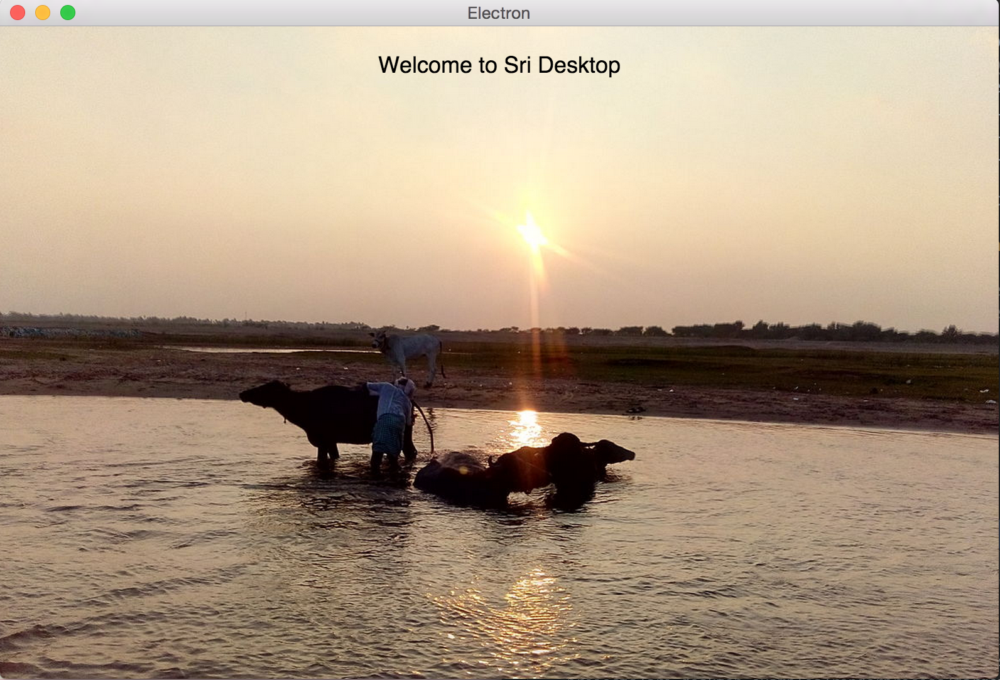

# Sri Desktop Template

[Sri](https://github.com/chandu0101/sri) desktop app template based on [Electron](https://github.com/atom/electron)



# Modules 

#### MainProcess 

>In Electron, the process that runs package.json's main script is called the main process. The script that runs in the main process can display a GUI by creating web pages.

Scala.js version of main.js   

#### RenderProcess

>Since Electron uses Chromium for displaying web pages, Chromium's multi-process architecture is also used. Each web page in Electron runs in its own process, which is called the renderer process.

Define all your components/business logic in this module

# How to Run

```scala

// in root(sri-desktop-template)) folder

sbt ~fastOptDesktopMain

// open new terminal tab , in in root(sri-desktop-template)) folder

sbt ~fastOptDesktopRender

// open new terminal tab

npm install  //one time

webpack  // one time 

npm start

ctrl/Cmd + R - to refresh 

```


